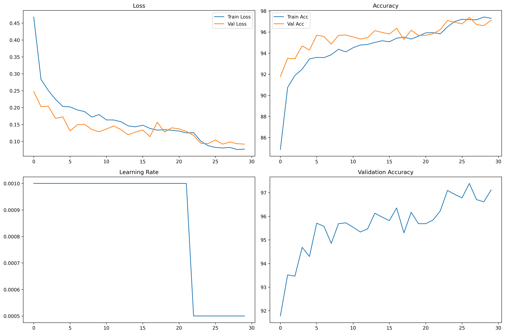

# Maps Classifier: EuroSAT Deep Learning Pipeline

Welcome to the **Maps Classifier** project! This repository contains a series of deep learning pipelines for classifying satellite images from the [EuroSAT dataset](https://github.com/phelber/eurosat). The project demonstrates the evolution of training strategies, model architectures, and best practices in computer vision for remote sensing.

---

## 🚀 Project Overview

- **Goal:** Classify land use and land cover from satellite images using state-of-the-art deep learning models.
- **Dataset:** [EuroSAT](https://github.com/phelber/eurosat) (10 classes, RGB, 224x224)
- **Framework:** PyTorch
- **Pipelines:**
  - **V1:** MobileNetV2, basic augmentation
  - **V2:** EfficientNet-B0, extensive augmentation, better logging & visualization
  - **V3:** GoogleLeNet (Inception V1), advanced augmentation, stratified split, richer metrics *(in progress)*

---

## 🏗️ Pipeline Evolution & Behind the Scenes

### V1: Baseline (MobileNetV2)
- **Script:** `trainingV1.py`
- **Model:** MobileNetV2 (pretrained, custom head)
- **Augmentation:** Random crop, flips, rotation, color jitter
- **Split:** 80/20 random
- **Logging:** JSON (logging not fully functional)
- **Result:** ~96.78% validation accuracy
- **Key Logic:**
  - Custom `FolderImageDataset` for loading images
  - Simple training loop with early stopping
  - Model checkpointing

<details>
<summary>V1 Log (excerpt)</summary>

```
sorry, the logging did not work

the validation accuracy best is 96.78%
```
</details>

---

### V2: Stronger Model & Augmentation (EfficientNet-B0)


- **Script:** `trainingV2.py`
- **Model:** EfficientNet-B0 (pretrained, custom classifier, early layers frozen)
- **Augmentation:**
  - RandomResizedCrop (wider scale)
  - More flips (horizontal, vertical)
  - Stronger ColorJitter, RandomGrayscale, RandomAffine
- **Split:** 80/20 random (reproducible)
- **Logging:** CSV, JSON summary, plots
- **Visualization:**
  - Confusion matrix
  - Training history (loss, accuracy, learning rate)
- **Model Saving:** Best model + frozen inference model with metadata
- **Result:**
  - **Best Validation Accuracy:** 97.39%
  - **Final Validation Accuracy:** 97.11%
- **Key Logic:**
  - Modular code (separate functions for training, validation, logging)
  - Extensive data augmentation for robustness
  - Improved logging and visualization for analysis

#### 📈 V2 Training History



- **Top Left:** Loss curves (train/val)
- **Top Right:** Accuracy curves (train/val)
- **Bottom Left:** Learning rate schedule
- **Bottom Right:** Validation accuracy

#### 📊 V2 Log (excerpt)
<details>
<summary>Click to expand</summary>

```
epoch,train_loss,train_acc,val_loss,val_acc,learning_rate
1,0.468...,84.87,0.247...,91.78,0.001
...
27,0.080...,97.18,0.091...,97.39,0.0005
30,0.077...,97.30,0.091...,97.11,0.0005
```
</details>

#### 📝 Upgrade Notes: V1 → V2
See [`upgrade‑notes/V1toV2.md`](upgrade‑notes/V1toV2.md) for a detailed breakdown of improvements, logic, and results.

---

### V3: Advanced Augmentation & Metrics (GoogleLeNet/Inception V1)

- **Script:** `trainingV3.py` *(in progress)*

- **Model:** GoogleLeNet (all layers trainable, custom head)

- **Augmentation:**
  - Even more aggressive: AutoAugment, RandAugment, TrivialAugmentWide, RandomErasing
  - Larger rotation, more flips, stronger color jitter
- **Split:** Stratified 80/20 (ensures class balance)
- **Metrics:**
  - Accuracy, precision, recall, F1, macro F1, confusion matrix, classification report
- **Logging:** CSV, JSON (all metrics), improved plots
- **Training:** Mixed-precision (AMP), deterministic seeding
- **Expected Result:** >98% validation accuracy
- **Key Logic:**
  - Stratified splitting for fair evaluation
  - Richer metrics for deeper insight
  - Modular, extensible codebase

#### 📝 Upgrade Notes: V2 → V3

See [`upgrade‑notes/V2toV3.md`](upgrade‑notes/V2toV3.md) for the full plan and rationale.

---

## 🧠 How It Works: Code Logic Highlights

- **Data Loading:** Custom PyTorch `Dataset` classes for robust, flexible image loading.
- **Augmentation:** Progressive increase in augmentation complexity to improve generalization.
- **Model Selection:** Each version upgrades the backbone for better feature extraction and transfer learning.
- **Training Loop:** Early stopping, learning rate scheduling, and checkpointing for efficient training.
- **Logging & Visualization:**
  - CSV/JSON logs for easy analysis
  - Plots for loss, accuracy, learning rate, and confusion matrix
- **Reproducibility:** Deterministic seeds and stratified splits (V3) for fair comparison.

---

## 📂 References & Artifacts

- **Upgrade Notes:**

  - [V1 to V2](upgrade‑notes/V1toV2.md)

  - [V2 to V3](upgrade‑notes/V2toV3.md)

- **Logs:**

  - [V1 Log](V1_log.csv)
  - [V2 Log](V2_log.csv)

- **Visualizations:**
  - [V2 Training History](V2_training_history.png)
  - [V2 Confusion Matrix](V2_confusion_matrix.png)

---

## 🛠️ Getting Started

1. **Install dependencies:**
   ```bash
   pip install -r requirements.txt
   ```
2. **Prepare the EuroSAT dataset:**
   - Place the dataset in `data/2750/` with subfolders for each class.
3. **Train a model:**
   - Run one of the training scripts:
     ```bash
     python trainingV1.py
     # or
     python trainingV2.py
     # or (recommended, in progress)
     python trainingV3.py
     ```
4. **Check logs and visualizations:**
   - See the `logs/` and `models/` folders for outputs.

---

## 🤝 Contributing

Contributions, suggestions, and issues are welcome! Please open an issue or pull request.

---


#### This is part of Shipwrecked

<div align="center">
  <a href="https://shipwrecked.hackclub.com/?t=ghrm" target="_blank">
    
  </a>
</div>