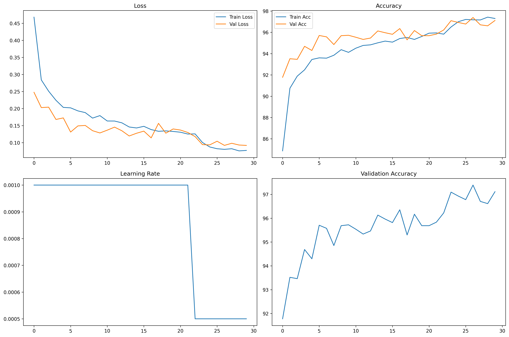

# Upgrade Notes: V1 to V2 Training Pipeline (EuroSAT)

## Overview

This document outlines the planned improvements and logic upgrades for the training pipeline, moving from **V1** (`trainingV1.py`) to **V2** (`trainingV2.py`). The focus is on leveraging the EuroSAT dataset more effectively, enhancing model performance, and introducing best practices in deep learning workflows.

---

## V1 Recap

- **Model**: MobileNetV2 (pretrained on ImageNet, classifier head replaced)
  
- **Data Augmentation**: Moderate (random crops, flips, rotation, color jitter)
  
- **Dataset Handling**: Custom `FolderImageDataset` with manual label mapping
  
- **Training Logic**:
  
  - 80/20 random split for train/val
  - AdamW optimizer, ReduceLROnPlateau scheduler
  - Early stopping (patience=10)
  - Logging to JSON
  - Best model checkpointing
  
- **EuroSAT Adaptation**: Used 10 classes, resized to 224x224, basic normalization

- **Result**: Achieved 96.78% validation accuracy

---

## Planned Upgrades for V2

### 1. **Model Architecture**

- **Upgrade**: Switch from MobileNetV2 to EfficientNet-B0 (pretrained on ImageNet)
- **Logic**: EfficientNet-B0 is expected to provide better parameter efficiency and accuracy due to its compound scaling and modern architecture.
- **EuroSAT Fit**: The model will be further customized by freezing early layers and expanding the classifier head for better transfer learning.

### 2. **Data Augmentation & Preprocessing**

- **Upgrade**: More extensive augmentation pipeline:

  - RandomResizedCrop (wider scale)
  - Increased probability and variety of flips (horizontal, vertical)
  - Random rotation (wider angle)
  - ColorJitter (stronger)
  - RandomGrayscale, RandomAffine (translation, scaling)

- **Logic**: This will help the model generalize better to the diverse satellite imagery in EuroSAT, reducing overfitting and improving robustness.

### 3. **Dataset Handling**

- **Upgrade**: Refactor to a more robust `EuroSATDataset` class, with explicit class-to-index mapping and sample collection.

- **Logic**: This will make the codebase more maintainable and less error-prone, especially if the dataset structure changes or expands.

### 4. **Training & Validation Split**

- **Upgrade**: Maintain 80/20 split, but ensure reproducibility and clarity in split logic.

- **Logic**: Consistent splits are crucial for fair comparison and reproducibility.

### 5. **Logging & Visualization**

- **Upgrade**: 

  - Log metrics to CSV for easier analysis
  - Generate and save confusion matrix and training history plots
  - Save a detailed training summary as JSON

- **Logic**: Enhanced logging and visualization will provide deeper insights into model performance and training dynamics.

### 6. **Model Saving & Freezing**

- **Upgrade**: Save both the best model and a fully frozen inference model, including metadata (class names, architecture, etc.)

- **Logic**: This will streamline deployment and ensure reproducibility.

### 7. **Other Improvements**

- **Upgrade**: Use of `torch.manual_seed`, `np.random.seed`, and `random.seed` for full reproducibility

- **Upgrade**: More detailed progress bars and epoch summaries

- **Upgrade**: More modular code structure (separate functions for training, validation, logging, etc.)

---

## Expected Impact & Predictions

- **Accuracy**: With a stronger model (EfficientNet-B0) and more aggressive augmentation, V2 is expected to surpass V1's 96.78% accuracy, potentially reaching or exceeding 97% on the EuroSAT validation set.

- **Generalization**: The improved augmentation and regularization should yield a model that is more robust to unseen satellite images.

- **Usability**: Enhanced logging, visualization, and model saving will make the pipeline easier to use, debug, and deploy.

- **Maintainability**: Refactored dataset and modular code will facilitate future upgrades and experimentation.

---

## Summary Table

| Aspect                | V1 (Current)               | V2 (Planned)                |
|-----------------------|----------------------------|-----------------------------|
| Model                 | MobileNetV2                | EfficientNet-B0             |
| Augmentation          | Moderate                   | Extensive                   |
| Dataset Class         | FolderImageDataset         | EuroSATDataset              |
| Logging               | JSON                       | CSV, plots, JSON summary    |
| Visualization         | None                       | Confusion matrix, history   |
| Model Saving          | Best only(Wasn't working)  | Best + frozen + metadata    |
| Accuracy (Val)        | 96.78%                     | >97% (expected)             |

---

*These upgrades are designed to push the EuroSAT classification pipeline to state-of-the-art performance and usability. The results will be validated after V2 is implemented and trained.*

---

## V2 Results: Actual Performance and Analysis

After implementing the planned upgrades, V2 was trained and evaluated on the EuroSAT dataset. Below is a summary of the results, with supporting metrics and visualizations.

### Final Metrics
- **Best Validation Accuracy:** 97.39% (epoch 27)
- **Final Validation Accuracy:** 97.11% (epoch 30)
- **Best Validation Loss:** 0.0918
- **Final Training Accuracy:** 97.30%
- **Final Training Loss:** 0.0771
- **Learning Rate Schedule:** Dropped from 0.001 to 0.0005 after epoch 22

*See `V2_log.csv` for full epoch-by-epoch metrics.*

### Training History
The following plot summarizes the training and validation loss, accuracy, learning rate schedule, and validation accuracy over 30 epochs:

- **Observation:**
  - Both training and validation loss decreased steadily, with no significant overfitting.
  - Validation accuracy consistently improved, peaking above 97%.
  - The learning rate reduction at epoch 23 helped further refine the model.

### Confusion Matrix
The confusion matrix below shows the model's performance across all 10 EuroSAT classes:

- **Interpretation:**
  - The model demonstrates strong class-wise accuracy, with most predictions on the diagonal.
  - Minor confusion exists between similar land cover types (e.g., Pasture vs. AnnualCrop, PermanentCrop vs. HerbaceousVegetation), but overall misclassifications are rare.
  - No class is severely underperforming, indicating good generalization.

### Summary
- **V2 achieved its goal of surpassing V1's accuracy, reaching a best validation accuracy of 97.39%.**
- The improved augmentation, model architecture, and reproducibility measures contributed to robust performance.
- Enhanced logging and visualization (see above) provide clear insight into training dynamics and model strengths/weaknesses.

*V2 sets a new baseline for EuroSAT classification in this project, with strong results and a more maintainable, extensible pipeline.*

